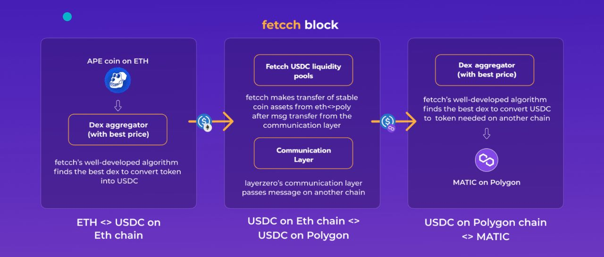

# Overview

- Fetcch block enables faster cross-chain any token to any token exchanges by leveraging communication layers in place of bridges.

- Fetcch block initiates swaps for the desired token using dex aggregator and stable coin liquidity pools deployed on all of the most popular chains instead of requiring users to lock or burn tokens and then mint them on the target chain.

- Process: For example user wants to swap APE coin on Ethereum for Matic on Polygon.

  - The user will select these desired pairs and chains.
  - Fetcch block then swaps APE coin for stablecoin in the source chain’s liquidity pool and sends a message using messaging layer to the destination chain.
  - The stablecoin is then swapped from the liquidity pool to Matic and transferred to the user’s wallet after receiving the message on the destination chain.

---

- Users can now exchange any token for any token in a significantly shorter amount of time without having to burn or mint new tokens or pay for gas on the destination chain.
