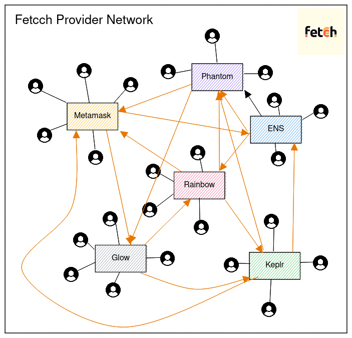

import Callout from 'nextra-theme-docs/callout'

# Provider

A Provider can be a wallet or dApp or anyone who wants to issue their own branded identities to their users and connect to a vast network of similar but different providers and their users.

---

Each provider is connected to the other one and subsequently their users also thus creating a decentralized, p2p network of wallet ids and providers.

Provider needs to first register and acquire their namespace, these namespaces should be unique and alphanumeric. They can acquire this from **Fetcch Registry** (more on this below).

The provider acts as a hub for a user to connect with other users from other hubs (providers). They also act as a relayer, with valid signatures, and they can edit user data on **provider registry** contract.

The provider also has the option to mint NFTs to `default.address` of anyone who registers an ID on their namespace. These will directly be handled by the FPCN Network.

<Callout emoji="💡">
  If you think enough, FPCN works on a Hub & Spoke model, wherein a Provider
  acts as a hub and users as spoke!
</Callout>
