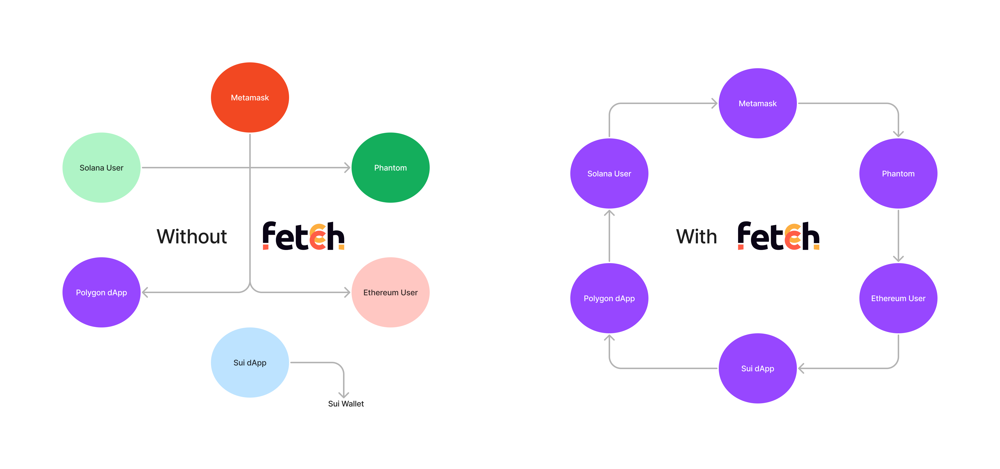

# Introduction

The current blockchain infrastructure is very fragmented. Because of a fragmented ecosystem, developers can’t support every possible blockchain or wallet, contributing to blockchain’s low adoption rate over the years. In 2021, many blockchains were having record high activity but users were having a hard time navigating their identities, and funds across multiple ecosystems, and because of this many people labeled blockchain as the “biggest failed project in human history”.

But we think differently, blockchain is not a failed project and undoubtedly not dead, we know how much blockchains can change our lives but it is not possible with the currently available infrastructure. To make blockchain usable, we need users to have a single identity across multiple ecosystems and make it super easy to move funds between these ecosystems. In simple words, what we need is **Abstraction**, abstract away multiple addresses, abstract bridges and DEXs, and abstract anything and everything that is a complex flow.

Fetcch Payment Connectivity Network is all about abstracting the complexities of blockchains away. Instead of managing multiple identities which are random like `0x1234...` or `EqjufD...` or only limited to a single ecosystem like `satyam.eth` or `satyam.sol`, use a single aggregated chain agnostic identities like `satyam@metamask`